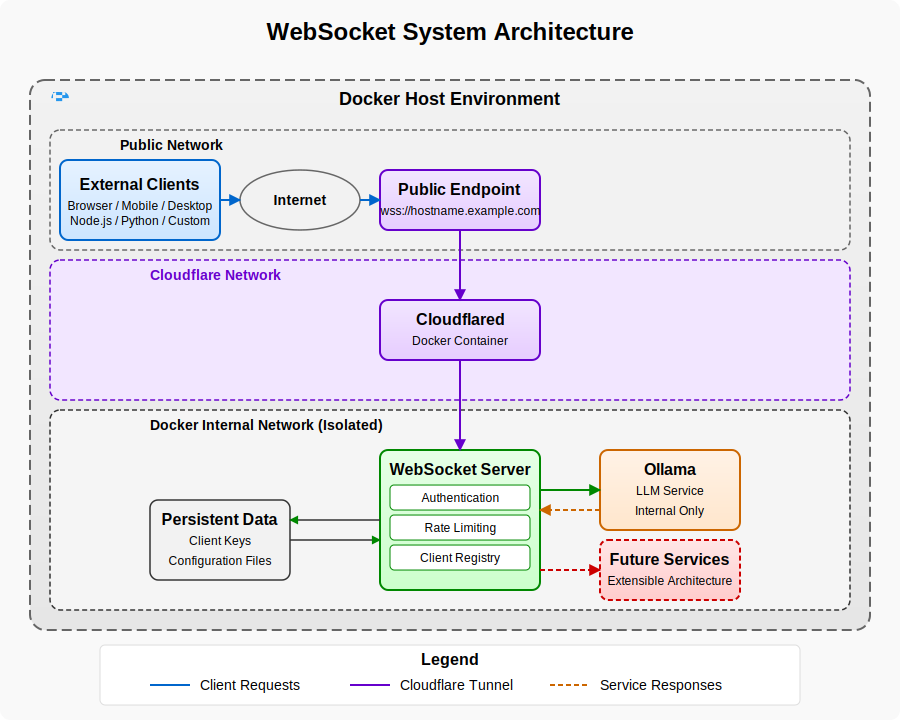

# WebSocket System

A secure WebSocket gateway with robust authentication and access control. Currently supports Ollama language models with plans for additional services.



## Table of Contents

- WebSocket System
  - Table of Contents
  - Overview
  - Features
  - Documentation
  - Quick Start
    - Prerequisites
    - Standard Installation
    - Docker Installation
    - Cloudflare Tunnel Setup
  - Configuration
  - Command-Line Interface
  - Client Management
    - Setting Up a Client
    - Using the Web Interface
    - Client Libraries
  - Development
  - License

## Overview

WebSocket System provides a secure, authenticated gateway for various backend services. The system is designed to be extensible, with Ollama language models being the first supported service. It solves several critical problems:

1. **Security**: Adds public-key authentication to services that don't have built-in security
2. **Access Control**: Lets you manage which clients can access your backend services
3. **Real-time Delivery**: Streams data to clients as it's generated
4. **Cross-platform Support**: Enables any WebSocket-capable platform to interact with your services
5. **Secure External Access**: Optional Cloudflare Tunnel integration for secure remote access

For a detailed introduction, see our Getting Started Guide.

## Features

- **Public-Key Authentication**: Client authentication using the same proven approach as SSH
- **Real-time Data Streaming**: Delivers outputs as they're generated
- **Client Management Tools**: Easy-to-use utilities for adding, listing, and revoking clients
- **Rate Limiting**: Built-in protection against brute force attacks
- **Service Extensibility**: Designed to support multiple backend services (currently Ollama)
- **Docker Integration**: Complete containerized solution with no external dependencies
- **Cross-Platform Compatibility**: Connect from browsers, Node.js, Python, or any WebSocket-capable client
- **Cloudflare Tunnel**: Secure external access without exposing ports or managing SSL certificates

Our Security Model documentation explains the authentication system in detail.

## Documentation

We provide comprehensive documentation to help you get started, implement clients, and understand the system:

- Getting Started Guide - First steps for new users
- API Reference - Complete WebSocket and REST API details
- Security Model - In-depth explanation of the authentication system
- **Client Implementations**:
  - Node.js Client - How to build Node.js clients
  - Python Client - How to build Python clients
  - Browser Client - How to build web clients
- Cloudflare Tunnel Setup - Secure external access setup
- Troubleshooting Guide - Solutions for common issues

## Quick Start

### Prerequisites

- Node.js 16.0.0 or higher
- npm 7.0.0 or higher
- Docker (for containerized deployment, recommended)

### Standard Installation

```bash
# Clone the repository
git clone https://github.com/monkeyscanjump/ws-system.git
cd ws-system

# Install dependencies
npm install

# Build the TypeScript code
npm run build

# Run the setup script to create directories and an admin client
npx manager setup

# Start the server
npm start
```

### Docker Installation

```bash
# Clone the repository
git clone https://github.com/monkeyscanjump/ws-system.git
cd ws-system

# Run the setup command (creates necessary directories and configurations)
npx manager setup --use-docker=true

# Start the system with Docker Compose
npx manager start-system

# Check system status
npx manager system-status

# View logs
npx manager system-logs
```

When using Docker, you don't need to install Ollama separately as it's included in the Docker Compose setup.

### Cloudflare Tunnel Setup

For secure external access without port forwarding or SSL certificates:

```bash
# Set up Cloudflare Tunnel (requires a Cloudflare account)
npx manager setup-cloudflared --hostname=your-subdomain.your-domain.com

# Start the system with Cloudflare Tunnel
npx manager start-system
```

## Configuration

Configuration is handled via environment variables or a .env file. The system offers an interactive configuration tool:

```bash
# Interactive configuration
npx manager configure-env

# Configure with specific options
npx manager configure-env --port=8080 --log-level=debug
```

Key settings include:

| Variable | Description | Default |
|----------|-------------|---------|
| `PORT` | WebSocket server port | `3000` |
| `OLLAMA_API_URL` | URL to the Ollama API | `http://ollama:11434` in Docker |
| `OLLAMA_DEFAULT_MODEL` | Default model if not specified | `llama2` |
| `CLOUDFLARE_HOSTNAME` | Hostname for Cloudflare Tunnel | `subdomain.example.com` |

Run `npx manager scan-env` to identify any missing environment variables in your configuration.

## Command-Line Interface

The system includes a comprehensive CLI manager for all administrative tasks:

```bash
# Get overall help
npx manager --help

# Get help for a specific command
npx manager setup-cloudflared --help
```

Available commands:

| Command | Description |
|---------|-------------|
| `setup` | Initialize the server environment |
| `generate-keys` | Generate client key pair |
| `register-client` | Register a new client |
| `list-clients` | List all registered clients |
| `revoke-client` | Revoke client access |
| `backup-clients` | Backup client database |
| `configure-env` | Configure environment settings |
| `setup-cloudflared` | Set up Cloudflare Tunnel |
| `start-system` | Start Docker containers |
| `stop-system` | Stop Docker containers |
| `system-status` | Show container status |
| `system-logs` | View container logs |
| `build-image` | Build Docker image |

## Client Management

### Setting Up a Client

```bash
# Generate a key pair
npx manager generate-keys --name=my-client

# Register with the server
npx manager register-client --name=my-client --key-path=./keys/my-client_key.pub
```

### Using the Web Interface

The simplest way to test your connection:

1. Open your browser to `http://localhost:3000` (or your Cloudflare Tunnel URL)
2. Enter your Client ID and private key
3. Click "Connect"
4. Once connected, send requests to your backend services

### Client Libraries

We provide detailed implementation guides for building clients:

- Node.js Client Implementation
- Python Client Implementation
- Browser Client Implementation

## Development

To set up a development environment:

```bash
# Install dependencies
npm install

# Start in development mode (with auto-reload)
npm run dev

# Run the CLI in development mode
npm run dev:manager -- command [options]
```

For running tests:

```bash
# Run all tests
npm test

# Generate test coverage report
npm run test:coverage
```

## License

MIT
