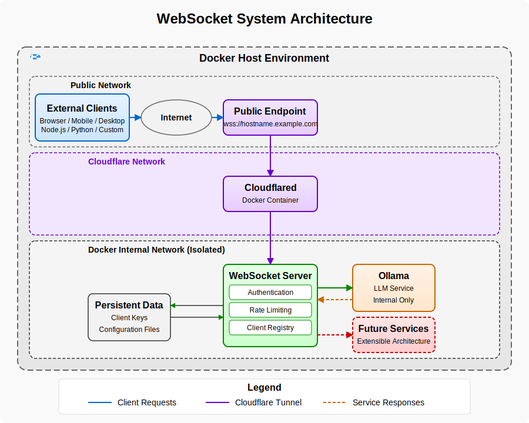

# Getting Started with WebSocket System

This guide will walk you through setting up and using the WebSocket System, a secure gateway that provides authentication, access control, and real-time communication for various backend services.

## Introduction

WebSocket System creates a secure communication layer between clients and backend services using public-key authentication. The system currently supports Ollama LLM as its primary backend service, with an extensible architecture designed to accommodate additional services in the future.



## System Requirements

- **Node.js**: Version 16.0.0 or higher
- **npm**: Version 7.0.0 or higher
- **Docker** (recommended): Latest stable version for containerized deployment
- **Cloudflare Account** (optional): For secure external access via Cloudflare Tunnel

## Installation

You can install and run the WebSocket System either as a standalone application or using Docker (recommended).

### Standard Installation

For development or standalone use:

```bash
# Clone the repository
git clone https://github.com/monkeyscanjump/ws-system.git
cd ws-system

# Install dependencies
npm install

# Build the TypeScript code
npm run build
```

### Docker Installation (Recommended)

For production deployments:

```bash
# Clone the repository
git clone https://github.com/monkeyscanjump/ws-system.git
cd ws-system

# Install dependencies (needed for the CLI tools)
npm install
```

## Initial Setup

The WebSocket System uses a comprehensive CLI manager tool for all administrative tasks. The setup process involves creating required directories, generating client keys, and configuring the environment.

### Using the Setup Command

The easiest way to get started is to use the all-in-one setup command:

```bash
# For standard installation
npx manager setup

# For Docker deployment (recommended)
npx manager setup --use-docker=true
```

This interactive setup will:
1. Create necessary directories
2. Compile TypeScript code (if needed)
3. Generate admin client credentials
4. Create default configuration files
5. Prompt you to configure Docker (if --use-docker=true)
6. Optionally set up a Cloudflare Tunnel for secure access

### Manual Configuration

If you prefer to configure each component individually:

#### 1. Create required directories

```bash
npx manager configure-env
```

This interactive command will guide you through setting up your .env file with appropriate configuration values.

#### 2. Generate admin client keys

```bash
npx manager generate-keys --name=admin --key-size=2048
```

This creates a public/private key pair for the admin client.

#### 3. Register the admin client

```bash
npx manager register-client --name=admin --key-path=./keys/admin_key.pub
```

This registers the admin with the system using the generated public key.

## Running the System

### Docker Deployment (Recommended)

If you chose Docker deployment during setup, you can start the system with:

```bash
npx manager start-system
```

This will:
1. Build the Docker image if needed
2. Start all required containers (WebSocket server, Ollama, Cloudflared if configured)
3. Set up the necessary Docker networks for secure isolation

To check the status of your system:

```bash
npx manager system-status
```

To view logs:

```bash
npx manager system-logs
npx manager system-logs --service=ollama
```

To stop the system:

```bash
npx manager stop-system
```

### Standard Deployment

If running without Docker:

```bash
# Start the server
npm start
```

## Setting Up Secure External Access

The WebSocket System integrates with Cloudflare Tunnel to provide secure external access without exposing ports or managing SSL certificates.

```bash
# Set up Cloudflare Tunnel
npx manager setup-cloudflared --hostname=your-subdomain.your-domain.com

# Start the system with Cloudflare Tunnel enabled
npx manager start-system
```

After setup, your WebSocket server will be available at `wss://your-subdomain.your-domain.com` with full SSL encryption provided by Cloudflare.

## Managing Clients

The system uses public-key authentication similar to SSH. Each client needs a key pair for secure authentication.

### Creating New Clients

```bash
# Generate a key pair for a new client
npx manager generate-keys --name=client1

# Register the client with the server
npx manager register-client --name=client1 --key-path=./keys/client1_key.pub
```

### Listing Clients

```bash
# List all registered clients
npx manager list-clients

# Show detailed information including key fingerprints
npx manager list-clients --detailed
```

### Revoking Client Access

```bash
# Revoke a client's access
npx manager revoke-client --client-id=client1
```

### Backing Up Client Database

```bash
# Create a backup of all client data
npx manager backup-clients
```

## Connecting to the System

Clients connect to the WebSocket server using their client ID and private key for authentication.

### Web Interface

The simplest way to test your connection:

1. Open your browser to `http://localhost:3000` (or your Cloudflare Tunnel URL)
2. Enter your Client ID and private key
3. Click "Connect"
4. Once connected, you can interact with the backend services

### Client Libraries

The WebSocket System can be accessed from any platform that supports WebSockets:

- Web browsers (JavaScript)
- Node.js applications
- Mobile apps
- Desktop applications

The connection process involves:
1. Initial connection to the WebSocket server
2. Authentication using the client ID and a signature generated with the private key
3. After successful authentication, interaction with backend services

## Command Reference

The WebSocket System includes a comprehensive CLI manager for administrative tasks:

| Command | Description |
|---------|-------------|
| `setup` | Initialize the server environment |
| `generate-keys` | Generate client key pair |
| `register-client` | Register a new client |
| `list-clients` | List all registered clients |
| `revoke-client` | Revoke client access |
| `backup-clients` | Backup client database |
| `configure-env` | Configure environment settings |
| `setup-cloudflared` | Set up Cloudflare Tunnel |
| `start-system` | Start Docker containers |
| `stop-system` | Stop Docker containers |
| `system-status` | Show container status |
| `system-logs` | View container logs |
| `build-image` | Build Docker image |

For detailed help on any command:

```bash
npx manager <command> --help
```

## Troubleshooting

### Docker Issues

If you encounter issues with Docker:

```bash
# Check system status
npx manager system-status

# View logs for specific services
npx manager system-logs --service=websocket-server
npx manager system-logs --service=ollama

# Rebuild the Docker image
npx manager build-image --nocache
```

### Authentication Problems

If clients can't authenticate:

1. Verify the client is registered: `npx manager list-clients`
2. Check key permissions and formats
3. Ensure the private key corresponds to the registered public key
4. Verify the correct signature algorithm is being used

### Connection Issues

If you can't connect to the server:

1. Ensure the server is running: `npx manager system-status`
2. Check server logs: `npx manager system-logs`
3. Verify the WebSocket URL (ws:// for local, wss:// for Cloudflare Tunnel)
4. Check firewall settings if connecting remotely

## Next Steps

- Review the API Reference for detailed WebSocket API documentation
- Explore the Security Model to understand the authentication system
- Check out client implementation guides for Node.js and Browser

## Getting Help

If you encounter issues not covered in this guide, please:

1. Check the Troubleshooting Guide
2. Review existing GitHub issues
3. Create a new issue with detailed information about your problem
